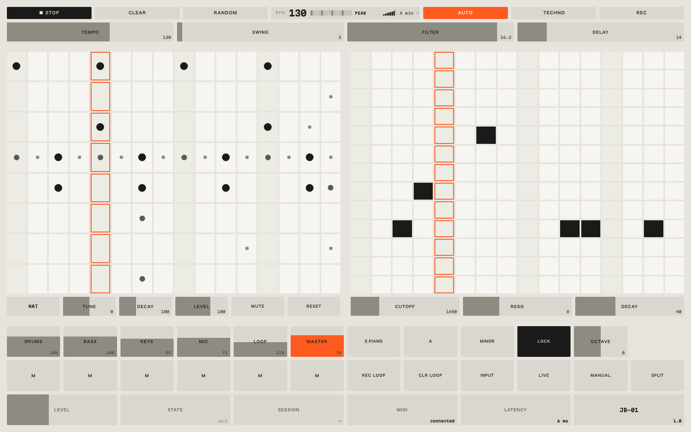

# JB-01

A drum machine, a bass sequencer, eight keyboard voices, a mic looper, a mixer,
a session recorder, and a generative DJ — in **one HTML file**.

No install, no build step, no dependencies, no account. Open it in a browser and
it works. There are also **no samples**: every sound is synthesised as you play
it. The kick is a pitch-swept sine, the snare is noise through a band-pass, the
hats are noise through a high-pass. That's why the whole instrument is a few
dozen kilobytes, and why you can retune any drum without it sounding stretched.

**[▶ Play it](https://mimosaagency.github.io/jb-01/)** · [Manual](https://mimosaagency.github.io/jb-01/manual.html)



---

## Auto Set

Press `AUTO` and the machine plays itself, indefinitely. It writes into the same
grid you use by hand, one bar ahead of the playhead, so you watch the set being
written while you hear it.

**It is not the RANDOM button on a timer.** Three things make four hours of one
drum machine listenable:

**One number decides everything.** A single *energy* value, 0 to 1, gates which
of the eight voices are *allowed* to play. A state machine walks that number
through `intro → groove → build → peak → breakdown`. A breakdown snaps energy
down rather than fading it, and drops the **kick** — not the record. Bass and
hats keep floating underneath with the filter closed and the delay opened up.

**It repeats.** A phrase is composed *once* and replayed for eight bars, with a
fill on the eighth. The first version regenerated every bar; it was technically
varied and musically unlistenable. This is the single most important detail in
the feature.

**The dice never choose the parts.** Kick, clap and hat placements come from a
small idiomatic vocabulary per genre. Randomness picks *which* correct option,
never where the kick lands.

A live trace, one line every four seconds:

```
38  breakdown  e0.20  cut 2059  dly45   6 cells
46  breakdown  e0.20  cut 2059  dly45   6 cells
49  build      e0.41  cut 3649  dly39   9 cells
53  build      e0.61  cut 8359  dly28  16 cells
57  build      e0.68  cut10105  dly24  26 cells
```

The filter opening 2k → 10k while the delay dries out and the parts pile in —
that's the machine doing what a DJ does with a filter knob.

Three genres: **techno** (130, A minor), **house** (124, swung, F dorian),
**dub** (120, sparse, long delay).

Verified over ~9,000 simulated bars (about 4.5 hours) across all three:
**zero exceptions, zero silent bars**, thinnest bar 6 hits.

### Playing along with it

Auto Set owns the drums, the bass and four shared knobs — never your keys, mic,
loop or mixer. It's a rhythm section that never stops. And it gives you the bar
back when you reach in:

- **Click a step** and your edit survives the sweep, until the phrase recomposes.
- **Grab a knob** (tempo, swing, filter, delay) and Auto Set stops driving it
  until the arrangement moves to the next section, then takes it back.

---

## Using it

| | |
|---|---|
| Grid | Each cell cycles through four states. Dot size is velocity. |
| Voice keys | Click the voice cell to change voice; tune, decay and level reshape it. Retune the tom down and shorten its decay and you have a different drum. |
| Keys | Eight presets. Leave **LOCK** on and every note is in key. |
| Mic | Record a one-bar loop, or run the mic live over the top. |
| `REC` | Captures the complete mix to a `.wav`, up to 15 minutes. |
| `JB-01` | Opens the manual. |

Shortcuts: `space` play · `c` clear · `r` random · `a` auto · `⇧R` record.

## What works where

| | |
|---|---|
| Sound | Everywhere. Tap once first — browsers block audio until you interact. |
| MIDI keyboard | **Chrome and Edge.** Firefox needs `dom.webmidi.gated=false`. Safari and iOS have no Web MIDI; everything else still works. |
| Microphone | Needs `https://` or `localhost`. |
| Recording | Downloads as `.wav`. With the optional local server it writes straight to a folder instead. |

Below 820px the layout becomes a pinned transport plus four tabs, so it's
playable on a phone.

## Running it locally

Optional. It buys you recordings written straight to a folder, a working
**Show in Finder** button, and a microphone over plain `http://`.

```bash
git clone https://github.com/mimosaagency/jb-01.git
cd jb-01 && JB01_DIR=$PWD python3 server/serve.py
```

Then open `http://localhost:8080`. It listens on `127.0.0.1` only.

Without it, just open `index.html` — the recorder falls back to a browser
download and nothing else changes.

## Credits

Built by [Danilo Sierra](https://github.com/danilosierrac) to give a Late-2009
iMac something to do. Type is Hiragino Sans, falling back to Zen Kaku Gothic
New, with Martian Mono for the readouts.

MIT licensed — see [LICENSE](LICENSE).
